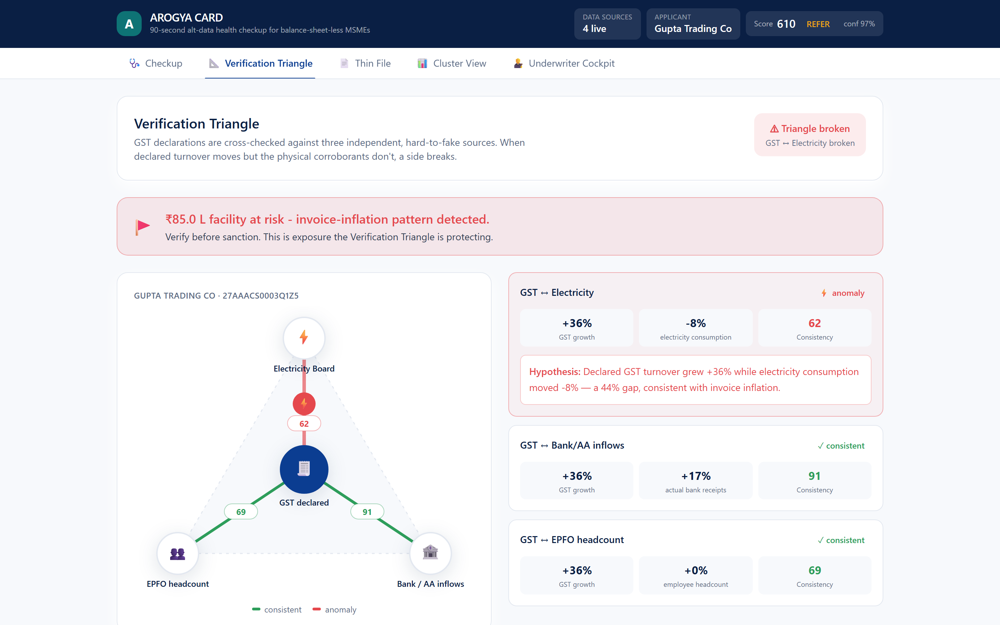
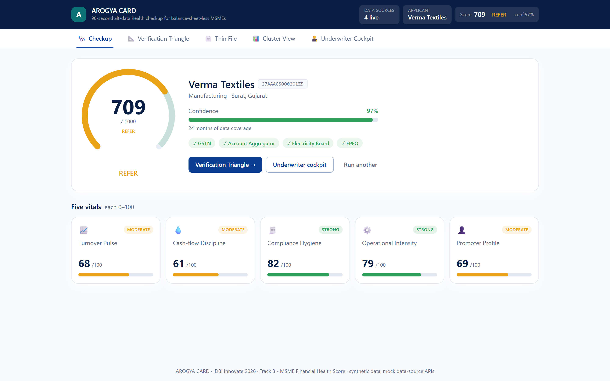
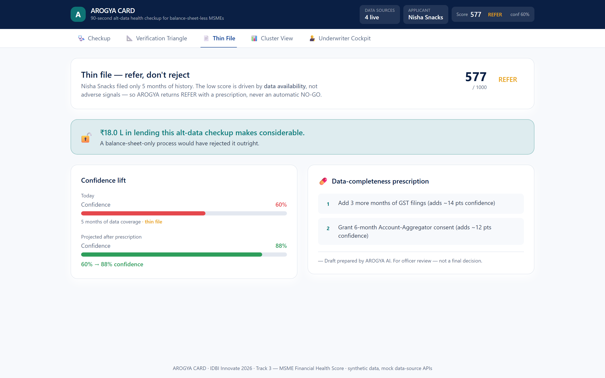
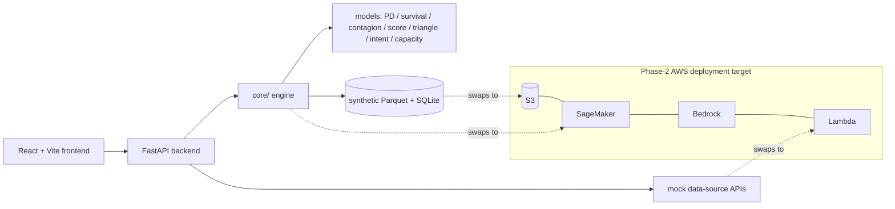

# AROGYA CARD - A 90-second alt-data health checkup for balance-sheet-less MSMEs, with a fraud-catching Verification Triangle.

> A 90-second alt-data health checkup for balance-sheet-less MSMEs, with a fraud-catching Verification Triangle.



**Built for IDBI Innovate 2026 - Track 3: MSME Financial Health Score, By the U-Team**

Runs entirely on **synthetic data we generate** (deterministic, `--seed 42`). External data
sources are **mock APIs** designed to swap for the IDBI sandbox endpoints in phase 2.

## The problem (in the bank's numbers)
Thin-file MSMEs are hard to underwrite from financials alone; invoice-inflation fraud slips through when only declared GST turnover is checked.

## The solution
- Five behavioural vitals → a unified 0–1000 health score with GO / REFER / NO-GO buckets.
- Data-coverage **confidence** - thin files get low confidence and REFER, never an automatic NO-GO.
- **Verification Triangle**: declared GST cross-checked against electricity, bank/AA inflows and EPFO headcount - catches invoice inflation.
- Mock GST / Account-Aggregator / electricity / EPFO integrations (swap to IDBI sandbox in phase 2).
- Peer-cluster percentiles, what-if assumptions, and one-click appraisal-note generation with a data-completeness prescription.

<p> </p>

## The Verification Triangle, auditable
Declared GST turnover is cross-checked against three independent real-operations signals -
electricity consumption, bank/AA inflows, and EPFO headcount. Each side computes the growth gap
between declared turnover and its corroborant; the GST↔electricity side uses **sector-calibrated
energy-intensity bands** (a trading firm's energy-per-₹ tolerance is wider than a foundry's).
A firm whose declared turnover races ahead of *all* its physical signals is the invoice-inflation
pattern - shown with the ₹ facility at risk, not just a score.


## Architecture

Phase-2 mapping: models → **SageMaker**, LLM narratives → **Bedrock**, mock integrations → **Lambda**, data → **S3**.

## Quickstart
```bash
make demo          # install, build frontend, generate data, train models, serve
# → open http://localhost:8002
```
Or with Docker:
```bash
docker build -t arogya-card .
docker run -p 8002:8002 arogya-card
```
No API keys required - the demo runs fully offline with deterministic template narratives.
Set `ANTHROPIC_API_KEY` (see `.env.example`) to enable LLM-authored documents.

## Data & honesty note
- **All data is synthetic by design** - no real customer data is used at this stage.
- **Mock APIs** (GST / Account-Aggregator / electricity / EPFO) return realistic JSON and swap to
  the IDBI sandbox in phase 2.
- **Metric methodology:** temporal (out-of-time) validation; the headline is AUC / balanced
  accuracy, never raw accuracy on an imbalanced target. Metrics sit in a *plausible* band by
  design - a near-perfect score would signal leakage or an unrealistic dataset.

## Regulatory alignment
Alt-data underwriting with human-in-the-loop; RBI IRAC vocabulary; thin-file fairness (no NO-GO purely for missing data).

## Team & contact
**The U-Team** - IDBI Innovate 2026 submission. Contact: [arungkind@gmail.com](mailto:arungkind@gmail.com).

---
_Every AI-generated document in this app ends with: "Draft prepared by AROGYA CARD AI. For officer review - not a final decision."_
